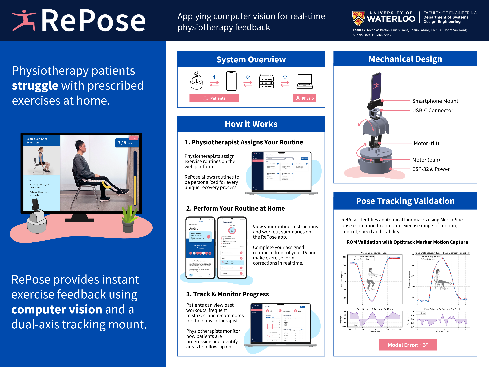

# RePose: Computer Vision-Assisted Physiotherapy Tool

RePose is a computer vision-based physiotherapy tool designed to assist patients with at-home exercises. By leveraging MediaPipe's pose estimation capabilities, RePose tracks body movements, evaluates exercise performance, and provides real-time feedback to ensure proper form and progress tracking.

## Features

### Real-Time Pose Tracking

- Uses MediaPipe to detect and track body landmarks during exercises.
- Tracks keypoints dynamically in 2D or 3D modes for accurate movement analysis.
- Supports symmetric and asymmetric exercises with side detection.

### Exercise Metrics

- Calculates angles, posture, and other metrics to evaluate exercise performance.
- Provides smoothed angle calculations for better accuracy.
- Tracks metrics like rep count, duration, and peak angles.

### Customizable Routines

- Supports predefined routines tailored to specific injuries (e.g., knee rehabilitation).
- Allows configuration of exercises, reps, and tracking details.
- Enables dynamic tracking adjustments based on user performance.

### Feedback and Alerts

- Provides real-time feedback on form, including alerts for improper posture or incomplete movements.
- Displays visual cues and messages on the video feed to guide users.
- Tracks and highlights key metrics like range of motion and alignment.

### Routine Scoring

- Evaluates and scores completed routines based on performance metrics.
- Calculates scores for individual exercises and overall routines.
- Saves routine data for later review or analysis.

### Web Application

- React-based frontend for user interaction and visualization.
- Allows users to view and manage their routines and performance data.
- Provides a dashboard for tracking progress over time.

### Android Application

- Mobile app integration for on-the-go physiotherapy sessions.
- Synchronizes with the backend to fetch routines and upload performance data.
- Offers a user-friendly interface for exercise guidance and feedback.

### Backend API

- Manages routines, pose data, and user progress.
- Provides endpoints for saving and retrieving routine data.
- Handles data persistence and synchronization between the web and mobile apps.

## Project Structure

- **`RePose_core/`**: Core logic for pose tracking, exercise processing, and routine management.
  - `main.py`: The main entry point for the application, handling video capture, pose tracking, and routine execution.
  - `physio_tools/`: Contains utility functions for angle calculations, smoothing, and exercise tracking.
  - `routines/`: Defines exercise and routine configurations.
  - `display/`: Handles visualization and feedback display on the video feed.
  - `scoring/`: Implements scoring logic for exercises and routines.
- **`api/`**: Backend API for managing routines and pose data.
- **`frontend/`**: React-based frontend for user interaction and visualization.
- **`graphics/`**: Contains visual assets, such as posters and diagrams.
- **`PhysiKneed App/`**: Android app integration for mobile use.
- **`pose_estimation/`**: Additional pose estimation utilities and experiments.

## How It Works

1. **Setup**: The application initializes a video capture device and loads predefined exercise routines.
2. **Pose Tracking**: MediaPipe detects body landmarks in real-time from the video feed.
3. **Exercise Processing**: The system calculates angles and metrics based on the detected landmarks and predefined exercise configurations.
4. **Feedback**: Alerts and feedback are displayed on the video feed to guide the user.
5. **Routine Scoring**: After completing a routine, the system evaluates performance and saves the results.

## Acknowledgments

MediaPipe for pose estimation.
OpenCV for video processing.
