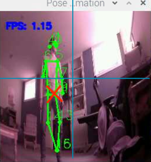

# Pose Estimation on the Raspberry Pi 4

Modified from this source: https://github.com/ecd1012/rpi_pose_estimation/tree/main

This code contains the original setup instructions, however they shouldn't be needed.

This estimator is a bit janky - it uses a lightweight PoseNet model. (Porting the other MoveNet model was not possible due to some RPI tensorflow library limitations)

This code gets the vertical and horizontal offset from the centre of the frame to the point between the left and right hip keypoint. Feel free to use these to control the motors, or modify it as you like. You could add some sort of threshold for the offset that forces the motors to move or something

```                 
offset_x = detected_x - (256) / 2
offset_y = detected_y - (256) / 2

print(f"OFFSET- x: {offset_x}, y: {offset_y}")
```



## Instructions
Running this command should start-up the estimator:
```
python3 run_pose_estimation.py --modeldir posenet_mobilenet_v1_100_257x257_multi_kpt_stripped.tflite --output_path pose_images
```
